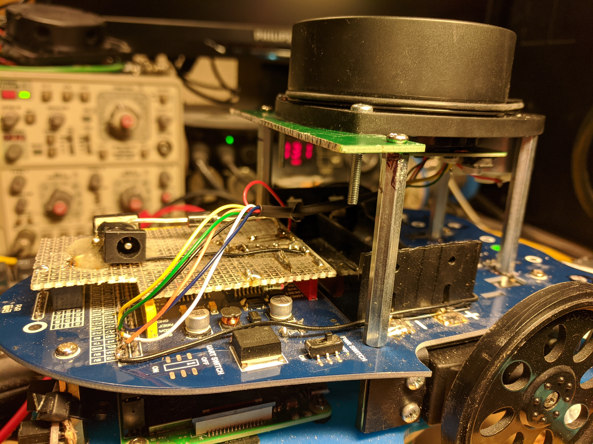
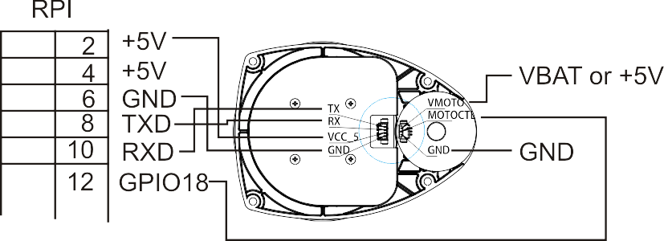

# Slamtec RPLIDAR on an Alphabot with a Raspberry PI



The project describes how to mount and interface the XV11 laser range
finder onto the
[Alphabot](https://www.open-electronics.org/alphabot-the-open-source-robot/)
 -- Raspberry PI version.

The actual name of the sensor is Piccolo Laser Distance Sensor,
abbreviated into LDS, but many different names are used to refer to
it: Neato LDS, Neato lidar, XV-11 lidar, XV-11 sensor...

This repository contains a C++ class which reads the coordinates
and also does the motor control via hardware PWM of the RPI.

## Wiring

There are two plugs which plug into the LIDAR. One is for the data and
the other for the motor control. The data is transmitted via the
Raspberry PI serial port and the speed is controlled with PWM at
GPIO pin 18.

Use the cable which comes with the LIDAR and plug the two plugs into
the LIDAR and chop off the single connector at the other end.

Solder the wires to the serial port of the Raspberry PI
and port 18:



The motor should be receiving the unregulated battery voltage (<10V) or
a regulated 5V but the serial interface requires 5V regulated.

# Software

## Prerequisites

Install the pigpio package and development headers:
```
apt-get install libpigpio-dev
```

## Xv11 C++ class

The class has `start()` and `stop()` functions which start and
stop the data acquisition and also start and stop the motor of
the range finder.

The data is transmitted via `DataInterface` where the abstract function
`newScanAvail(XV11Data (&data)[Xv11::nDistance])` needs to be implemented
which then receives both the polar and Cartesian coordinates after
a successful 360 degree scan. Register your `DataInterface` with
`registerInterface`.

## Example program
`printdata` prints tab separated data as
`x <tab> y <tab> r <tab> phi <tab> strength <tab> too_close` until a key is pressed.

Pipe the data into a textfile and plot it with `gnuplot`:
```
sudo ./printdata > tt2.tsv
gnuplot> plot "tt2.tsv"
```

